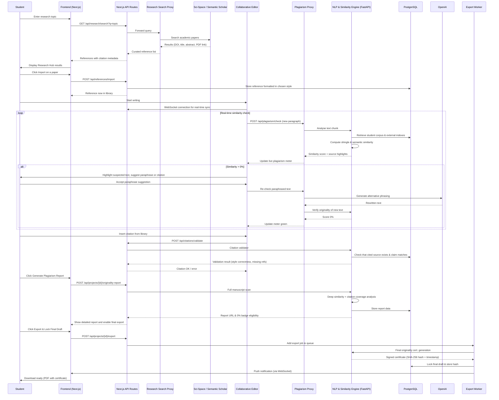

# ScholarForge – Architecture & Plagiarism‑Free Workflow

This document describes the complete technical architecture of **ScholarForge**, the end‑to‑end platform that helps final‑year students research, write, cite and certify their projects with 0% plagiarism.

---

## 1. System Architecture (Container & Component View)

The diagram below shows all major components, data stores, and external services and how they interact.

```mermaid
graph TB
    subgraph User_Agents["Users"]
        Student["Student Browser"]
        Supervisor["Supervisor / University Admin"]
    end

    subgraph CDN_Edge["Edge & CDN"]
        Vercel["Vercel Edge Functions"]
        Cloudfront["CloudFront CDN (Assets)"]
    end

    subgraph Frontend["Frontend (Next.js 14)"]
        ClientApp["Next.js App Router (React Server Components)"]
        EditorUI["Rich Text Editor (TipTap / ProseMirror)"]
        ResearchPanel["Research Hub Panel"]
        PlagiarismWidget["Live Plagiarism Meter"]
        CitationSidebar["Citation & Reference Manager"]
        RoadmapView["Project Roadmap & Milestones"]
        ExportModule["Export (PDF/DOCX/LaTeX)"]
    end

    subgraph API_Layer["API Layer (Next.js API Routes)"]
        AuthAPI["Authentication API (NextAuth)"]
        ProjectAPI["Project & Template API"]
        ResearchAPI["Research Search Proxy"]
        CitationAPI["Citation Formatting API"]
        PlagiarismProxy["Plagiarism Check Proxy"]
        CollaborationGateway["Real-time Collaboration Gateway (WebSocket, Socket.io)"]
    end

    subgraph Core_Services["Backend Microservices"]
        subgraph NLP_Service["NLP & Plagiarism Engine (FastAPI)"]
            TextProcessor["Text Preprocessor"]
            SimilarityEngine["Similarity & Shingle Matching"]
            ParaphraseAssist["Paraphrase Assistant (OpenAI LLM)"]
            CitationValidator["Citation-Text Validator"]
            ReportGenerator["Plagiarism Report Generator"]
        end
        subgraph BackgroundWorkers["Background Workers (BullMQ)"]
            BulkSimilarityWorker["Bulk Similarity Check"]
            ReferenceMetadataFetcher["Reference Metadata Updater"]
            ExportWorker["Document Export & Stamping"]
        end
    end

    subgraph Data_Stores["Data Stores"]
        PostgreSQL["PostgreSQL (Main DB)"]
        Redis["Redis (Cache, Pub/Sub, Job Queue)"]
        S3["S3 Bucket (Exported PDFs / Temp)"]
    end

    subgraph External_APIs["External Research & AI APIs"]
        SciSpace["Sci-Space API"]
        SemanticScholar["Semantic Scholar API"]
        CORE["CORE.ac.uk API"]
        Unpaywall["Unpaywall API"]
        Crossref["Crossref REST API"]
        OpenAI["OpenAI API"]
    end

    subgraph Integrity_Layer["Integrity & Certificate"]
        HashModule["SHA-256 Hasher"]
        BlockchainStamp["Optional Blockchain Timestamp"]
    end

    %% User flows to Frontend
    Student --> Vercel
    Supervisor --> Vercel
    Vercel --> ClientApp
    ClientApp --> EditorUI
    ClientApp --> ResearchPanel
    ClientApp --> PlagiarismWidget
    ClientApp --> CitationSidebar
    ClientApp --> RoadmapView
    ClientApp --> ExportModule

    %% Frontend to API
    EditorUI -- "Real-time text sync" --> CollaborationGateway
    ResearchPanel -- "Search queries" --> ResearchAPI
    CitationSidebar -- "Cite request" --> CitationAPI
    PlagiarismWidget -- "Check snippet" --> PlagiarismProxy
    ExportModule -- "Generate final doc" --> ProjectAPI

    %% API to Core Services
    ResearchAPI -- "Proxy search" --> SciSpace
    ResearchAPI -- "Proxy search" --> SemanticScholar
    ResearchAPI -- "Proxy search" --> CORE
    ResearchAPI -- "Proxy search" --> Unpaywall
    CitationAPI -- "Get CSL styles / metadata" --> Crossref
    CitationAPI -- "Format citation" --> PostgreSQL
    PlagiarismProxy -- "Submit text" --> NLP_Service
    CollaborationGateway -- "Broadcast edits" --> Redis
    ProjectAPI -- "Export job" --> BackgroundWorkers

    %% NLP Service detail
    TextProcessor --> SimilarityEngine
    TextProcessor --> CitationValidator
    SimilarityEngine --> ReportGenerator
    ParaphraseAssist --> OpenAI
    CitationValidator --> PostgreSQL
    ReportGenerator --> Redis

    %% Background workers
    BulkSimilarityWorker --> SimilarityEngine
    ReferenceMetadataFetcher --> Crossref
    ReferenceMetadataFetcher --> SemanticScholar
    ExportWorker --> S3
    ExportWorker --> HashModule
    HashModule --> BlockchainStamp

    %% Data flows
    Redis -- "Publish events" --> CollaborationGateway
    PostgreSQL -- "Read/Write data" --> API_Layer
    PostgreSQL -- "Store references" --> NLP_Service
    S3 -- "Retrieve exports" --> ExportModule
    Vercel -- "Serve static" --> Cloudfront

    %% Integrity layer after final export
    HashModule --> PostgreSQL
    BlockchainStamp --> PostgreSQL
```

**Key interactions:**
- The **Research Hub** proxies queries to Sci‑Space, Semantic Scholar, CORE, and Unpaywall so students find only authentic, peer‑reviewed sources.
- The **Live Plagiarism Meter** constantly sends text snippets to the NLP microservice, which checks similarity against web sources, academic databases, and an anonymous student corpus.
- The **Paraphrase Assistant** uses OpenAI to suggest original rephrasings, and the original text is immediately re‑checked for similarity.
- Before export, the **Integrity Layer** hashes the final, 0%‑similarity document and stamps it (optionally on a blockchain) to create an immutable certificate.

---

## 2. End‑to‑End Sequence: From Research to Certified Submission

This sequence diagram details every step a student takes, from finding a reference to exporting a plagiarism‑free, cryptographically signed document.

**Sequence highlights:**
- **Authentic references first:** all citations come from vetted academic APIs – no predatory journals, no broken links.
- **Continuous originality feedback:** the plagiarism meter updates with every paragraph; the system never waits until submission day.
- **Assisted rewriting:** when similarity is detected, the Paraphrase Assistant suggests a new version, and that version is instantly re‑checked – creating a tight feedback loop.
- **Final lock & certificate:** the exported PDF includes an embedded SHA‑256 hash and timestamp, proving that the document achieved 0% similarity at the moment of export.

Both diagrams together describe the full technical implementation of ScholarForge’s zero‑plagiarism guarantee, from research to immutable certification.
